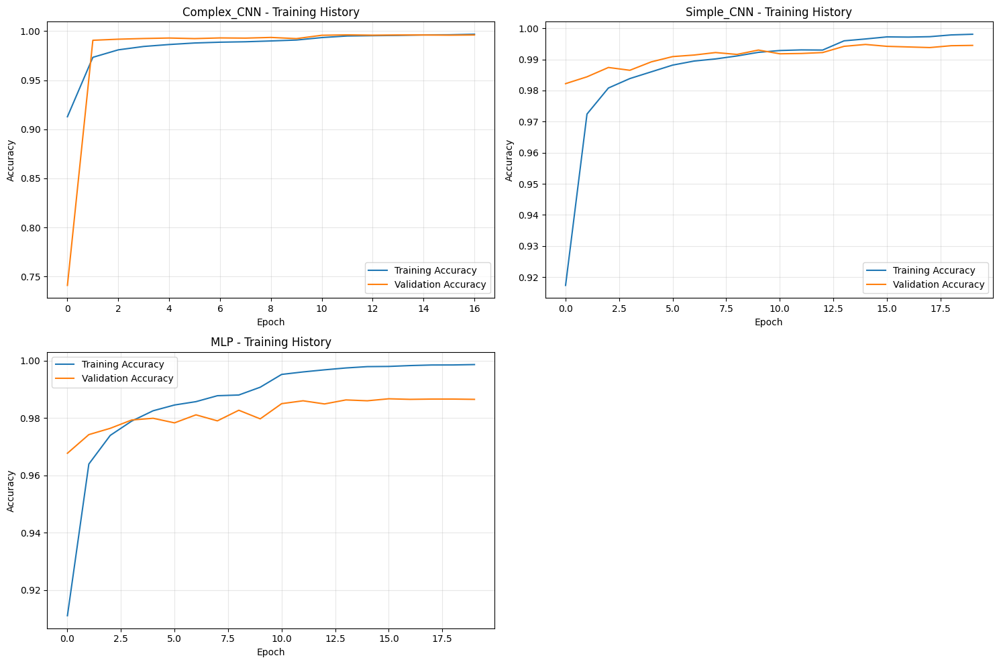
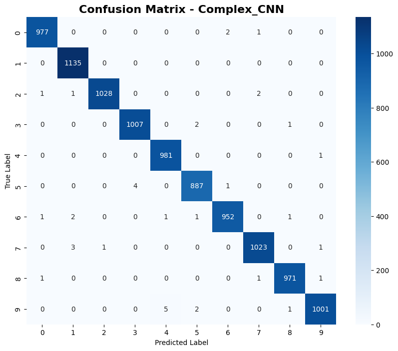
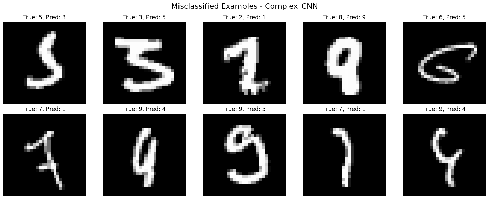
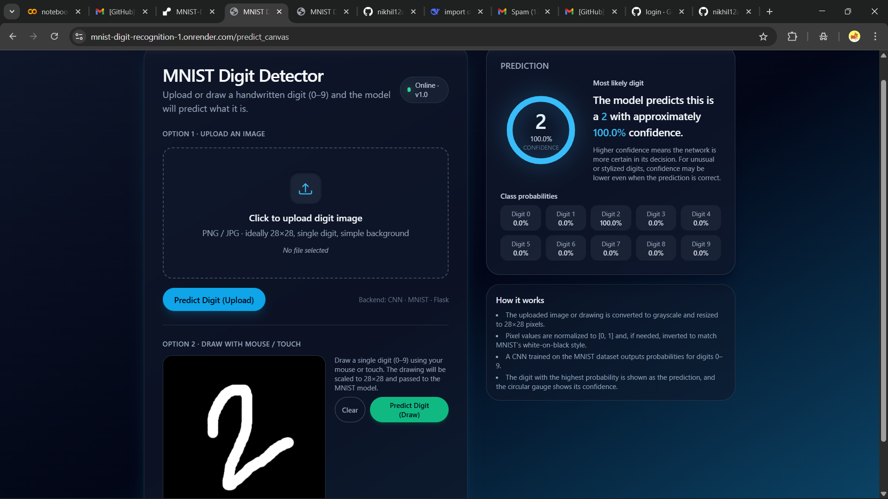

# MNIST Handwritten Digit Recognition — End-to-End ML Deployment Project

This project implements, trains, and deploys a **Convolutional Neural Network (CNN)** to classify handwritten digits (0–9) using the **MNIST dataset**.

The trained model is deployed using a **Flask REST API**, and predictions can be tested via:

- ✔ Git Bash using `curl`
- ✔ Docker container

This project covers the complete machine learning pipeline:
**Data → EDA → Modeling → Training → Saving → API Serving → Testing → Docker Deployment**


---

# 1. Problem Description

Handwritten digit recognition is used in real-world applications such as:

> Bank check processing

> Postal code reading

> Scanned document analysis

> Education apps

> The goal is to classify grayscale 28×28 images into one of 10 digits (0–9).

**Why this problem matters**

Digit recognition is a classic ML task that builds intuition for working with image data, CNNs, deployment, and API design.

Evaluation Metric:

✔ Accuracy is used because MNIST is a balanced dataset.

---

# 2. Dataset Information (MNIST)

| Property       | Value                       |
| -------------- | --------------------------- |
| Train Images   | 60,000                      |
| Test Images    | 10,000                      |
| Shape          | 28×28 grayscale             |
| Classes        | 10 (0–9)                    |
| Size           | ~11.4 MB                    |
| Downloaded via | `tensorflow.keras.datasets` |

----

# 3. Data Preparation & EDA

> Performed in processing_and_EDA.ipynb.

> Included steps:

> Normalize pixel values (0–1)

> Visualize sample digits

> Plot class distribution

> Inspect noise and artifacts

> Compare flattened vs. 2D images

> Prepare data for CNN and classical ML models

----

# 4. Modeling & Modeling Selection

The model_training.ipynb notebook compares:

MODEL COMPARISON RESULTS:

|       Model    | Test Accuracy | Training Time(s)  |  Complexity  |
|  ------------- | ------------- | ----------------  | ------------ |
|  Complex_CNN   |     0.9962    |      82.595442    |    High      |
|   Simple_CNN   |     0.9948    |      46.783939    |    High      |
|          MLP   |     0.9867    |      36.348113    |    Medium    |
|         k-NN   |     0.9705    |       0.023269    |     Low      |
| Random_Forest  |     0.9704    |      33.190552    |     Low      |
|          SVM   |     0.9684    |       7.863339    |    Medium    |


I have 4 comparison plots:

> Model Accuracy Comparison

> Training Time Comparison

> Accuracy vs Training Time

> Average Accuracy by Complexity 


# Best Model Selection




# Final Model Evaluation




`models/final_complex_cnn.h5`


# Misclassified Examples (Complex CNN)

These are the images where the model predicted incorrectly.  
Understanding these mistakes helps improve the model.




# 5. Training the Final Model

Run:

```python train.py```

This script:

✔ Loads MNIST
✔ Builds + trains CNN
✔ Prints accuracy
✔ Saves the model

Final test accuracy: 0.9957

✔ Saved final model to:
``` models/mnist_cnn.h5
```

-----


# 7. Creating & Using a Virtual Environment (Recommended)

It is highly recommended to run the project inside a Python virtual environment.

Step 1 — Create a virtual environment

```python -m venv venv```

Step 2 — Activate the virtual environment
> Windows (PowerShell):

```venv\Scripts\Activate.ps1```

> Windows (CMD):

```venv\Scripts\activate.bat```

> macOS / Linux:

```source venv/bin/activate```

Step 3 — Install dependencies

```pip install -r requirements.txt```

---


# 6. Running the Flask API

```python predict.py```

Endpoints:

| Endpoint |   Method   |   Description   |
|--------- | ---------- |  ---------------|
| /health  |	GET       |   Health check  |
| /predict |   POST     |   prediction    |

----

# 7. Testing the API Using Web Browser(UI)
```
http://127.0.0.1:5000
```
> `/health` endpoint:

```http://127.0.0.1:5000/health```

expected output:
```{"status": "ok", "model_loaded": true}```

> Test /predict with CURL (Recommended)
Works in CMD or Git Bash
❌ Does NOT work in PowerShell (file upload unsupported)

```curl -X POST -F "file=@test.png" http://127.0.0.1:5000/predict```

```
json
{
  "prediction": 7,
  "confidence": 0.97,
  "probs": [0.0009257748606614769, 0.0004005557275377214, 0.005929670762270689, 1.592421904206276e-05, 0.0015344960847869515, 8.810953659121878e-06, 2.577046700480423e-07, 0.9787270426750183, 0.00035585847217589617, 0.012101643718779087]
}
```
-----

# 8. Test Using Git Bash(curl)

Power Shell does not support file uploads(use Git Bash).

`curl -X POST -F "file=@images/digit_7.png" http://127.0.0.1:9696/predict`

-----

# 9. Docker Deployment

> Build Image

` docker build minst-app`

> Run Conatiner

(Default port)
`docker run -p 5000:5000 mnist-app`

(if port is busy)
`docker run -p 8080:5000 mnist-app`

(Test with curl)
`curl -X POST -F "file=@image/digit_7.png" http://127.0.0.1:5000/predict`

----

# 10. Cloud Deployment
> This project includes a fully deployed cloud-based MNIST Digit Recognition API using Render.com.

> The API hosts the trained deep-learning model and serves predictions for both:

```https://mnist-digit-recognition-1.onrender.com```

➤ Images uploaded from the web UI


